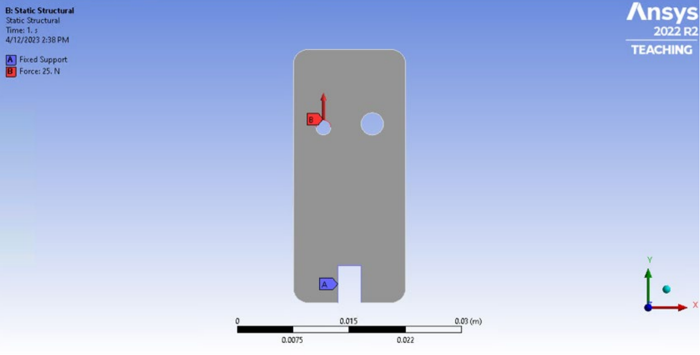
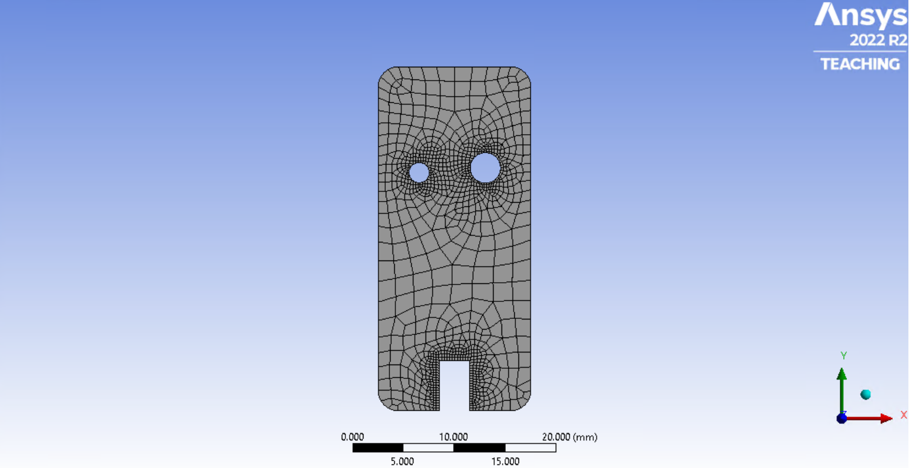
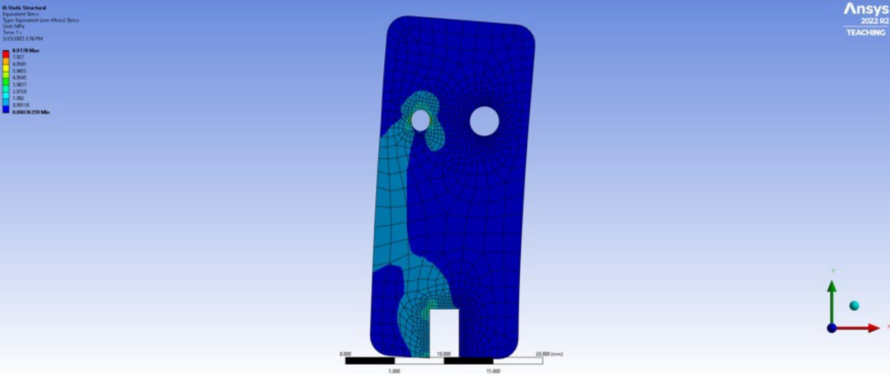
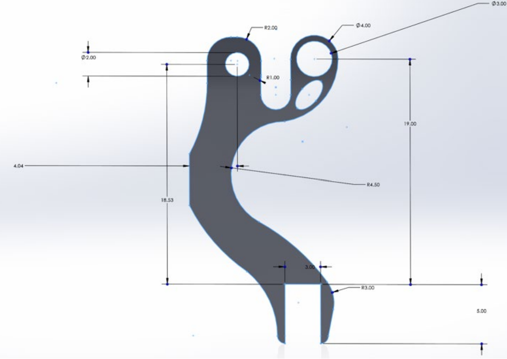
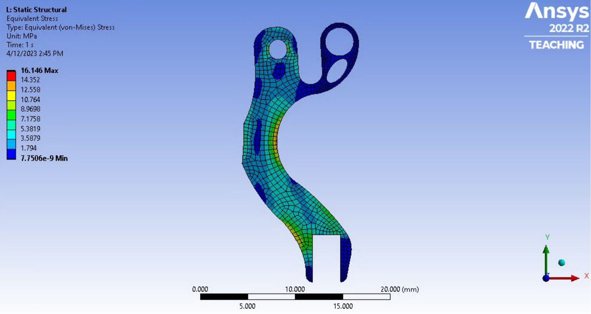

# Prosthetic_Hand_Bracket

## Overview
The project was dedicated to the design and optimization of a bracket used in prosthetic hand construction. Through advanced engineering analysis and the use of ANSYS software, the weight-to-strength ratio was significantly improved. There were two requirements for the existing design:
* The bracket had to support a 25N load at the left hole while being rigidly constrained by the connector's bottom surface.
* The two material choices were between Polypropylene (PP) and High-Density Polyethylene (HDPE).

## Key Achievements
* __Weight-to-Strength Optimization__: We optimized the weight-to-strength ratio of the prosthetic hand bracket design using the ANSYS software. Insights derived from Finite Element Analysis (FEA) methods allowed us to make informed decisions, resulting in a lightweight yet durable bracket.
* __Von Mises Stress Analysis__: We employed Von Mises Equivalent Stress analysis to identify high-stress and low-stress areas within the bracket. This analysis allowed us to remove unnecessary material from low-stress regions, achieving refinement while maintaining a safety factor of 2 for the bracket's structural integrity.
* __Robust Design__: To ensure the robustness of the model, we conducted a mesh independence study. This study confirmed that maximum stress levels converged within 5% of the target strength, validating the optimal bracket design. We also concluded that the best material for the bracket was Polypropylene.

## Technologies Utilized
* __ANSYS__: ANSYS software served as the foundation for our engineering analysis and optimization processes.
* __Stress and Strain Principles__: We applied fundamental principles of stress and strain to ensure the structural integrity of the prosthetic hand bracket.

## Boundary Conditions and Mesh Representation

## Stress Distribution

## Final Design

